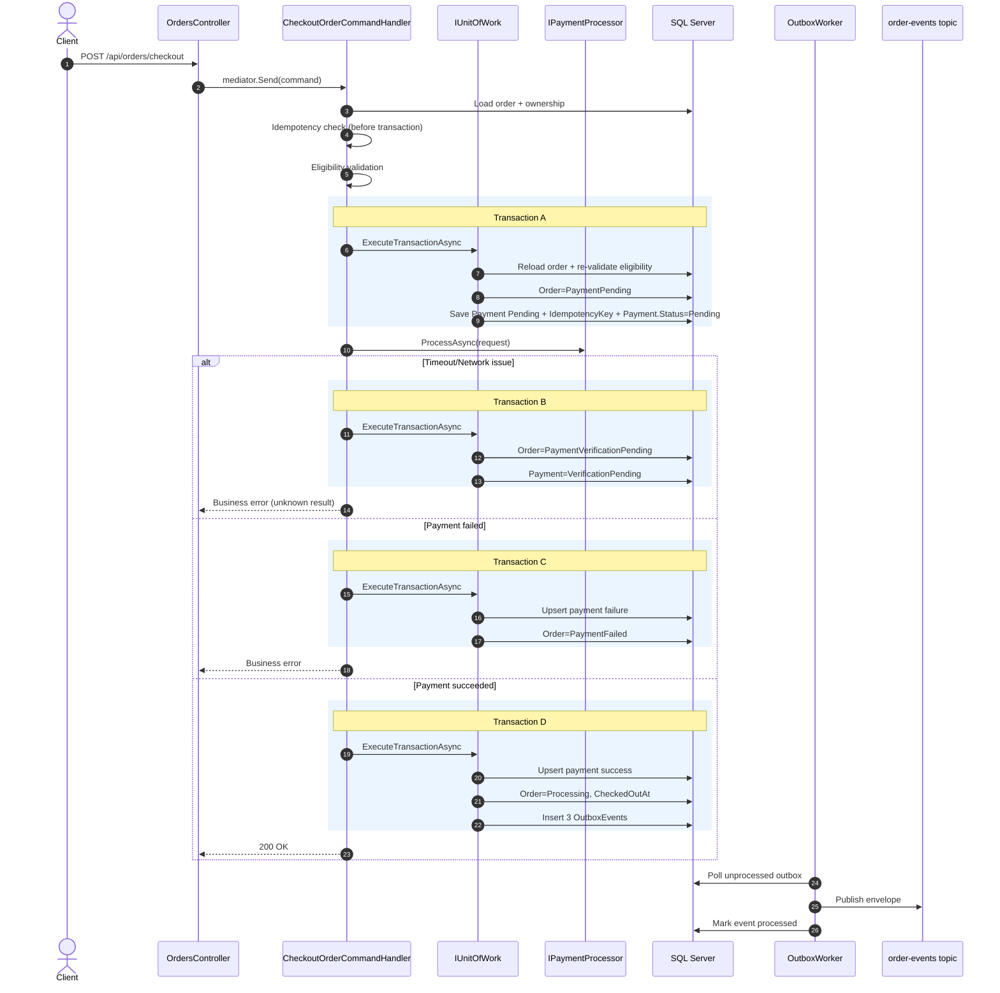

# System Design – Pixelz Order Checkout & Production Push

## 1) Requirements
### Functional
- Users can search their own orders by name with pagination.
- Users can checkout an order.
- When checkout is successful, the system emits asynchronous integration events for:
  1. Production processing
  2. Invoice generation
  3. Email notification

### Non-functional
- Preserve data integrity for order/payment workflows.
- Handle concurrent checkout safely.
- Support at-least-once asynchronous delivery.
- Return clear and actionable error responses.

---

## 2) Architecture
- Clean Architecture layers:
  - API: `OrderService.API`
  - Application: `OrderService.Application`
  - Domain: `OrderService.Domain`
  - Infrastructure: `OrderService.Infrastructure`
- CQRS with MediatR handlers:
  - `SearchOrdersQueryHandler`
  - `CheckoutOrderCommandHandler`
- EF Core + Repository + Unit of Work (`ExecuteTransactionAsync`).
- Outbox pattern with hosted `OutboxWorker`.
- Decoupling services by using MQ mechanism for integration events

---

## 3) High-Level Component Diagram


---

## 4) Data Model (Highlights)
### Core entities


### Status model
- `OrderStatus`: `Draft`, `PaymentPending`, `PaymentVerificationPending`, `PaymentFailed`, `Processing`, `Completed`, `Cancelled`
- `PaymentStatus`: `Pending`, `VerificationPending`, `Failed`, `Succeeded`, `Refunded`

### Important constraints/indexes
- Unique `Payment(OrderId)`.
- Unique filtered `Payment(OrderId, IdempotencyKey)` where key is not null.
- `Order.RowVersion` configured as concurrency token.
- Search support index: `Order(CustomerId, DisplayName)`.
- Outbox polling index: `(IsProcessed, CreatedAt)`.

---

## 5) API Contracts (Highlights)
### Common auth header (both endpoints)
```http
Authorization: Bearer <access_token>
```

### Search orders
- `GET /api/orders/me?orderName=&page=&pageSize=`
- Policy: `OrderRead`
- Key query params:
  - `orderName` (optional): partial display-name filter
  - `page` (default `1`)
  - `pageSize` (default `20`)

### Checkout order
- `POST /api/orders/checkout`
- Policy: `OrderCheckout`
- Request body:
  - `orderId` (Guid)
  - `paymentMethod` (string)
  - `idempotencyKey` (string)
- Success response:
  - `orderId`, `transactionId`, `message`

### Error mapping (global middleware)
- `NotFoundException` -> `404`
- `ConflictException` -> `409`
- `ArgumentException` -> `400`
- fallback -> `500`

---

## 6) Checkout Flow (Implemented Sequence)



**Transaction boundaries in current code**
- **Transaction A**: re-load order, re-check eligibility, set `Order.Status = PaymentPending`, persist payment pending state + idempotency key.
- **Transaction B** (timeout/network): set `Order = PaymentVerificationPending`, `Payment = VerificationPending`.
- **Transaction C** (payment failed): persist payment failure + set `Order = PaymentFailed`.
- **Transaction D** (payment succeeded): persist payment success, set `Order = Processing`, add 3 outbox events.

---

## 7) Integration Events (Key Points)
### Events produced after successful checkout
- `ProductionOrderRequested`
  - Payload: `OrderId`, `CustomerId`, `TransactionId`
- `InvoiceGenerationRequested`
  - Payload: `OrderId`, `CustomerId`, `Amount`, `Currency`
- `EmailNotificationRequested`
  - Payload: `OrderId`, `Amount`, `Currency`

---

## 8) Data Integrity & Reliability
- Idempotency key is persisted before provider call to reduce duplicate charge risk.
- State transitions are wrapped in transactional unit-of-work boundaries.
- Concurrency safety via row version + in-transaction re-validation.
- Compensation path persists final refund/failure outcome.
- Timeout/network uncertainty is modeled explicitly (`PaymentVerificationPending`).
- Current outbox flow is at-least-once, but it still needs dead-letter tracking for poison messages.

---

## 9) Performance
- Outbox worker uses batched polling (`BatchSize`).
- Indexed outbox lookup for unprocessed events.
- Indexed order-name lookup by customer (`CustomerId, DisplayName`).
- Search endpoint uses pagination (`page`, `pageSize`).

---

## 10) Security
- JWT Bearer authentication.
- Issuer validation via `JwtBearerValidationEvents`.
- Scope-based authorization policies:
  - `OrderRead`
  - `OrderCheckout`

---

## 11) Assumptions & Validation
### Assumptions
1. One order tracks one current payment state.
2. Payment provider may return success/failure/timeout.
3. Broker delivery is at-least-once, so consumer idempotency is required.

### Validation focus
- Functional: search and checkout success/failure/unknown scenarios.
- Concurrency: parallel checkout conflict behavior.
- Integration: outbox publish then mark-processed ordering.
- Compensation: post-payment failure updates are persisted correctly.

---

## 12) Known Gaps / Next Steps
- No tests have been added yet.
- **Payment processing is currently synchronous in the API request path** (`ProcessAsync` is called directly inside checkout flow).
  - This works for demo/mock scenarios.
  - For production scale, it should move to a more asynchronous model to reduce request latency and timeout risk.
- Outbox retry metadata + dead-letter strategy.
- Dedicated `IdempotencyRecord` table for stronger replay scenario.
- To avoid SPOF (single point of failure) of the single master Database, we can add a failover mechanism by adding a read replica and configuring the application to switch to the replica for read operations if the master is unavailable
